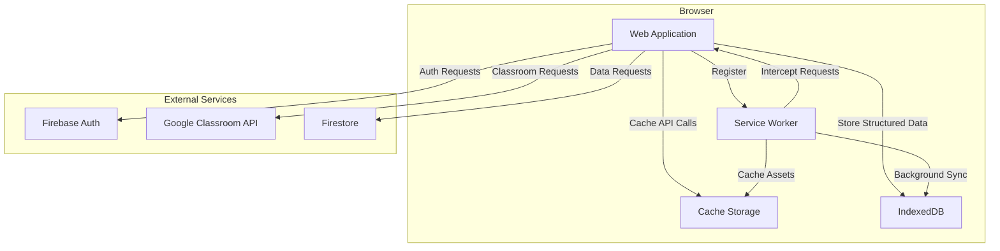
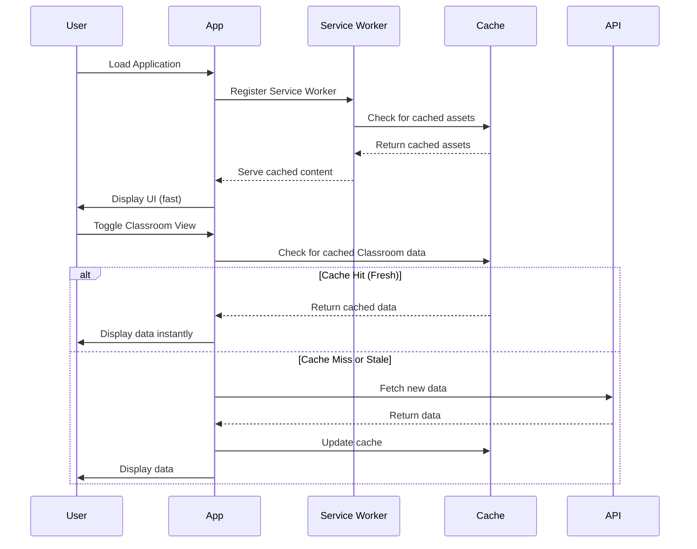
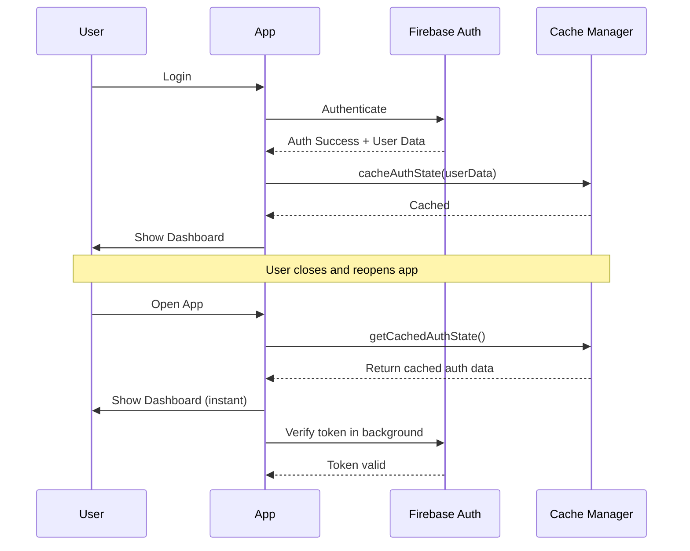
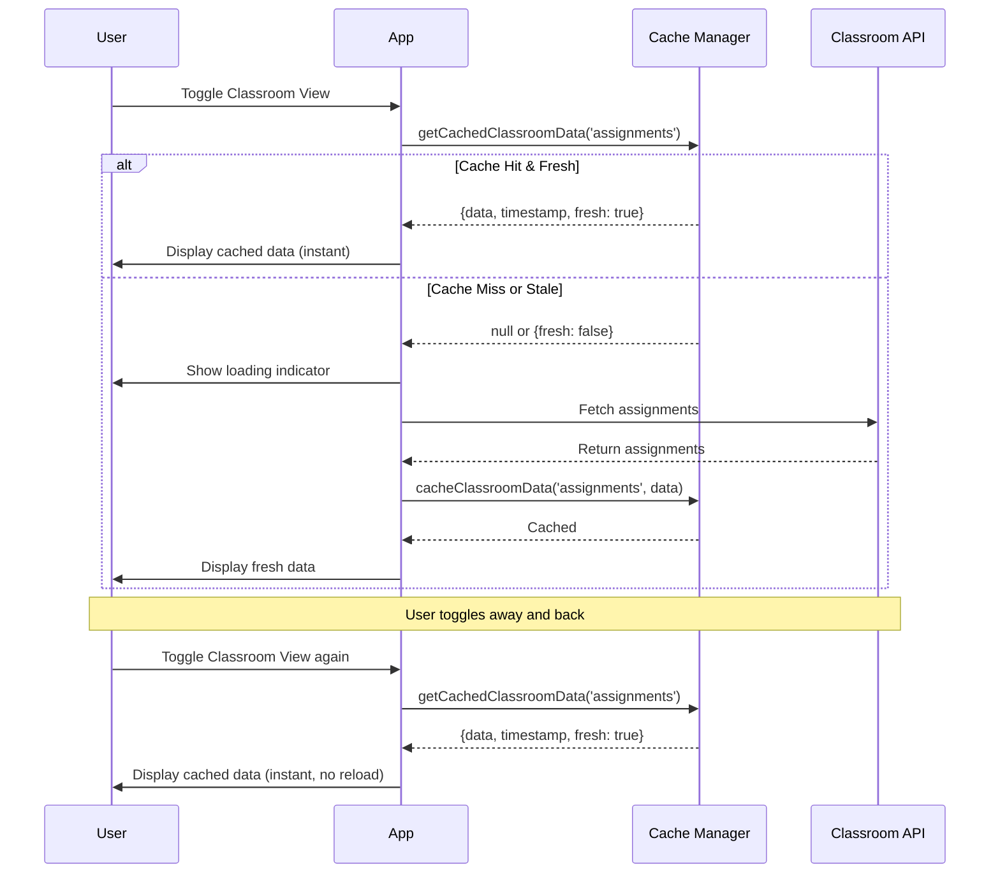

> Original Source: kiro_01/specs/pwa-setup-mobile/design.md

# Design Document: PWA Setup and Mobile Functionality

## Overview

This design implements a comprehensive Progressive Web App (PWA) solution for the b1t-Sched application. The system will detect existing PWA components, implement missing functionality, and provide robust caching strategies for both static assets and dynamic data (authentication state and Google Classroom information).

The implementation follows a modular approach with three main components:
1. **PWA Configuration Module** - Detects and validates existing PWA setup
2. **Service Worker** - Handles caching, offline functionality, and background sync
3. **Cache Manager** - Manages data caching for authentication and Google Classroom data

The design prioritizes user experience by ensuring fast load times, offline access to previously viewed content, and seamless installation on mobile devices.

## Architecture

### High-Level Architecture



### Component Interaction Flow



## Components and Interfaces

### 1. PWA Configuration Detector

**Purpose:** Detects and validates existing PWA configuration on application startup.

**Interface:**
```javascript
class PWADetector {
  /**
   * Checks if a web app manifest is present and valid
   * @returns {Promise<{exists: boolean, valid: boolean, errors: string[]}>}
   */
  async checkManifest()
  
  /**
   * Checks if a service worker is registered
   * @returns {Promise<{registered: boolean, scope: string, state: string}>}
   */
  async checkServiceWorker()
  
  /**
   * Validates manifest contains required fields
   * @param {object} manifest - The manifest object
   * @returns {{valid: boolean, missingFields: string[]}}
   */
  validateManifestFields(manifest)
  
  /**
   * Runs complete PWA detection and returns report
   * @returns {Promise<PWAReport>}
   */
  async detectPWAStatus()
}
```

**PWAReport Structure:**
```javascript
{
  manifest: {
    exists: boolean,
    valid: boolean,
    path: string,
    errors: string[]
  },
  serviceWorker: {
    registered: boolean,
    scope: string,
    state: string
  },
  installable: boolean,
  recommendations: string[]
}
```

### 2. Manifest Generator

**Purpose:** Creates a valid web app manifest file if one doesn't exist.

**Interface:**
```javascript
class ManifestGenerator {
  /**
   * Generates a complete manifest object
   * @param {object} config - Application configuration
   * @returns {object} Manifest object
   */
  generateManifest(config)
  
  /**
   * Creates manifest.json file in the public directory
   * @param {object} manifest - Manifest object
   * @returns {Promise<{success: boolean, path: string}>}
   */
  async createManifestFile(manifest)
  
  /**
   * Adds manifest link to HTML head
   * @returns {Promise<boolean>}
   */
  async linkManifestInHTML()
}
```

**Default Manifest Configuration:**
```json
{
  "name": "b1t-Sched - Academic Task Scheduler",
  "short_name": "b1t-Sched",
  "description": "A web-based academic task scheduler designed for university students",
  "start_url": "/",
  "display": "standalone",
  "background_color": "#ffffff",
  "theme_color": "#4CAF50",
  "orientation": "portrait-primary",
  "icons": [
    {
      "src": "/images/icon-192x192.png",
      "sizes": "192x192",
      "type": "image/png",
      "purpose": "any maskable"
    },
    {
      "src": "/images/icon-512x512.png",
      "sizes": "512x512",
      "type": "image/png",
      "purpose": "any maskable"
    }
  ]
}
```

### 3. Service Worker

**Purpose:** Handles caching strategies, offline functionality, and background synchronization.

**File:** `sw.js` (root directory)

**Caching Strategies:**

1. **Cache-First (Static Assets):**
   - HTML files
   - CSS files
   - JavaScript files
   - Images and icons
   - Fonts

2. **Network-First (API Calls):**
   - Firebase Auth requests
   - Firestore queries
   - Google Classroom API calls
   - Falls back to cache if network fails

3. **Stale-While-Revalidate (Dynamic Content):**
   - User profile data
   - Task lists
   - Event data

**Service Worker Structure:**
```javascript
// sw.js

const CACHE_VERSION = 'v1.0.0';
const STATIC_CACHE = `static-${CACHE_VERSION}`;
const DYNAMIC_CACHE = `dynamic-${CACHE_VERSION}`;
const API_CACHE = `api-${CACHE_VERSION}`;

// Assets to cache on install
const STATIC_ASSETS = [
  '/',
  '/index.html',
  '/css/main.css',
  '/css/components.css',
  '/css/dashboard.css',
  '/css/responsive.css',
  '/js/app.js',
  '/js/auth.js',
  '/js/classroom.js',
  '/js/db.js',
  '/js/ui.js',
  '/js/utils.js',
  '/Social-Preview.webp',
  '/images/preloader.gif'
];

// Install event - cache static assets
self.addEventListener('install', (event) => {
  event.waitUntil(
    caches.open(STATIC_CACHE)
      .then(cache => cache.addAll(STATIC_ASSETS))
      .then(() => self.skipWaiting())
  );
});

// Activate event - clean up old caches
self.addEventListener('activate', (event) => {
  event.waitUntil(
    caches.keys()
      .then(keys => Promise.all(
        keys
          .filter(key => key !== STATIC_CACHE && key !== DYNAMIC_CACHE && key !== API_CACHE)
          .map(key => caches.delete(key))
      ))
      .then(() => self.clients.claim())
  );
});

// Fetch event - implement caching strategies
self.addEventListener('fetch', (event) => {
  const { request } = event;
  const url = new URL(request.url);
  
  // Handle different request types
  if (isStaticAsset(url)) {
    event.respondWith(cacheFirst(request, STATIC_CACHE));
  } else if (isAPIRequest(url)) {
    event.respondWith(networkFirst(request, API_CACHE));
  } else {
    event.respondWith(staleWhileRevalidate(request, DYNAMIC_CACHE));
  }
});
```

### 4. Cache Manager

**Purpose:** Manages caching of authentication state and Google Classroom data.

**Interface:**
```javascript
class CacheManager {
  /**
   * Caches authentication state
   * @param {object} authData - Authentication data
   * @returns {Promise<boolean>}
   */
  async cacheAuthState(authData)
  
  /**
   * Retrieves cached authentication state
   * @returns {Promise<object|null>}
   */
  async getCachedAuthState()
  
  /**
   * Caches Google Classroom data
   * @param {string} type - 'assignments' or 'announcements'
   * @param {array} data - Classroom data
   * @returns {Promise<boolean>}
   */
  async cacheClassroomData(type, data)
  
  /**
   * Retrieves cached Classroom data
   * @param {string} type - 'assignments' or 'announcements'
   * @returns {Promise<{data: array, timestamp: number, fresh: boolean}|null>}
   */
  async getCachedClassroomData(type)
  
  /**
   * Checks if cached data is fresh (less than maxAge)
   * @param {number} timestamp - Cache timestamp
   * @param {number} maxAge - Maximum age in milliseconds
   * @returns {boolean}
   */
  isFresh(timestamp, maxAge)
  
  /**
   * Clears all user-specific caches
   * @returns {Promise<boolean>}
   */
  async clearUserCaches()
  
  /**
   * Gets cache size and usage statistics
   * @returns {Promise<{size: number, quota: number, usage: number}>}
   */
  async getCacheStats()
  
  /**
   * Clears old cache entries when storage limit is approached
   * @returns {Promise<boolean>}
   */
  async pruneOldCaches()
}
```

**Cache Storage Structure:**
```javascript
// Cache keys
const CACHE_KEYS = {
  AUTH_STATE: 'auth-state',
  CLASSROOM_ASSIGNMENTS: 'classroom-assignments',
  CLASSROOM_ANNOUNCEMENTS: 'classroom-announcements'
};

// Cache entry structure
{
  key: string,
  data: any,
  timestamp: number,
  version: string
}
```

### 5. Install Prompt Manager

**Purpose:** Manages the PWA install prompt and user preferences.

**Interface:**
```javascript
class InstallPromptManager {
  /**
   * Initializes install prompt listeners
   */
  init()
  
  /**
   * Captures the beforeinstallprompt event
   * @param {Event} event - The beforeinstallprompt event
   */
  captureInstallPrompt(event)
  
  /**
   * Shows the custom install prompt UI
   */
  showInstallPrompt()
  
  /**
   * Hides the install prompt UI
   */
  hideInstallPrompt()
  
  /**
   * Triggers the native browser install prompt
   * @returns {Promise<{outcome: string}>}
   */
  async triggerInstall()
  
  /**
   * Checks if user has dismissed the prompt before
   * @returns {boolean}
   */
  hasUserDismissed()
  
  /**
   * Saves user's dismiss preference
   */
  saveUserDismissal()
  
  /**
   * Checks if app is already installed
   * @returns {boolean}
   */
  isAppInstalled()
}
```

**Install Prompt UI:**
```html
<div id="install-prompt" class="install-prompt" style="display: none;">
  <div class="install-prompt-content">
    
    <div class="install-text">
      <h3>Install b1t-Sched</h3>
      <p>Install our app for quick access and offline use</p>
    </div>
    <div class="install-actions">
      <button id="install-btn" class="btn btn-primary">Install</button>
      <button id="dismiss-install-btn" class="btn btn-text">Not now</button>
    </div>
  </div>
</div>
```

### 6. Offline Indicator

**Purpose:** Displays visual feedback when the user is offline.

**Interface:**
```javascript
class OfflineIndicator {
  /**
   * Initializes online/offline event listeners
   */
  init()
  
  /**
   * Shows offline indicator
   */
  showOfflineIndicator()
  
  /**
   * Hides offline indicator
   */
  hideOfflineIndicator()
  
  /**
   * Checks current online status
   * @returns {boolean}
   */
  isOnline()
}
```

**Offline Indicator UI:**
```html
<div id="offline-indicator" class="offline-indicator" style="display: none;">
  <i class="fas fa-wifi-slash"></i>
  <span>You're offline. Showing cached content.</span>
</div>
```

## Data Models

### Cache Entry Model

```javascript
{
  key: string,           // Unique identifier for the cache entry
  data: any,            // The cached data (can be any serializable type)
  timestamp: number,    // Unix timestamp when data was cached
  version: string,      // Cache version for invalidation
  expiresAt: number     // Optional expiration timestamp
}
```

### PWA Configuration Model

```javascript
{
  manifestPath: string,
  serviceWorkerPath: string,
  cacheVersion: string,
  cacheMaxAge: {
    auth: number,        // milliseconds (default: 24 hours)
    classroom: number    // milliseconds (default: 1 hour)
  },
  cacheMaxSize: number,  // bytes (default: 50MB)
  offlinePages: string[] // Pages available offline
}
```

### Install Prompt State Model

```javascript
{
  promptEvent: Event|null,
  userDismissed: boolean,
  dismissedAt: number|null,
  installed: boolean,
  installedAt: number|null
}
```

## Data Flow

### Authentication State Caching Flow



### Google Classroom Data Caching Flow




## Correctness Properties

A property is a characteristic or behavior that should hold true across all valid executions of a system—essentially, a formal statement about what the system should do. Properties serve as the bridge between human-readable specifications and machine-verifiable correctness guarantees.

### Property 1: Missing Component Logging

*For any* PWA component that is missing during initialization, the system should generate a log message identifying that specific component.

**Validates: Requirements 1.3**

### Property 2: Manifest Field Validation

*For any* manifest object, validation should verify the presence of all required fields (name, short_name, icons, start_url, display) and return a list of any missing fields.

**Validates: Requirements 1.4**

### Property 3: Generated Manifest Completeness

*For any* generated manifest, it should contain all required PWA fields including name, short_name, description, theme_color, background_color, display mode set to "standalone", start_url set to "/", and icon definitions for at least 192x192 and 512x512 sizes.

**Validates: Requirements 2.2, 2.3, 2.4, 2.5**

### Property 4: Service Worker Static Asset Caching

*For any* service worker installation event, all defined critical static assets should be added to the static cache.

**Validates: Requirements 3.2**

### Property 5: Cache-First Strategy for Static Assets

*For any* network request for a static asset (HTML, CSS, JS, images), the service worker should check the cache first and only fetch from network if not found in cache.

**Validates: Requirements 3.3**

### Property 6: Network-First Strategy for API Calls

*For any* network request to an API endpoint (Firebase, Firestore, Google Classroom), the service worker should attempt network first and only fall back to cache if network fails.

**Validates: Requirements 3.4**

### Property 7: Install Prompt Visibility Based on State

*For any* application state, the install prompt should only be visible if: (1) the beforeinstallprompt event has been captured, (2) the user has not previously dismissed it, and (3) the app is not already installed.

**Validates: Requirements 4.2, 4.4, 4.6**

### Property 8: Authentication State Caching and Usage

*For any* successful authentication, the authentication state should be cached with a timestamp, and on subsequent application loads, this cached state should be used to initialize the UI before making network requests.

**Validates: Requirements 5.1, 5.3**

### Property 9: Cache Expiration Enforcement

*For any* cached entry with an expiration time, if the current time exceeds the expiration time, the cache manager should not return that entry as valid and should fetch fresh data.

**Validates: Requirements 5.5**

### Property 10: Classroom Data Caching with Timestamp

*For any* Google Classroom data fetch (assignments or announcements), the data should be stored in cache with the current timestamp, and subsequent fetches should update both the data and timestamp.

**Validates: Requirements 6.1, 6.5**

### Property 11: Classroom Data Freshness Check

*For any* Classroom view toggle, if cached data exists and its timestamp is less than 1 hour old, the cached data should be displayed immediately; otherwise, fresh data should be fetched from the API.

**Validates: Requirements 6.3, 6.4**

### Property 12: Independent Classroom Data Caching

*For any* caching operation on assignments, it should not affect the cached state of announcements, and vice versa - the two data types should be cached and retrieved independently.

**Validates: Requirements 6.7**

### Property 13: Cache Pruning on Threshold Exceeded

*For any* cache storage state where total size exceeds the defined threshold (50MB), the cache manager should remove the oldest entries first until size is below threshold.

**Validates: Requirements 7.1**

### Property 14: Critical Asset Prioritization

*For any* cache pruning operation, critical assets (HTML, CSS, core JavaScript) should be retained while optional data (old API responses, non-critical images) should be removed first.

**Validates: Requirements 7.2**

### Property 15: Cache Statistics Availability

*For any* cache state, the cache manager should be able to provide statistics including total size, quota, and usage percentage.

**Validates: Requirements 7.5**

### Property 16: Offline Content Serving

*For any* offline state, the service worker should serve cached pages, assets, and Google Classroom data (if available) without attempting network requests.

**Validates: Requirements 8.1, 8.2**

### Property 17: Offline Write Operation Queueing

*For any* write operation (task creation, completion toggle, etc.) attempted while offline, the operation should be added to a queue rather than failing.

**Validates: Requirements 8.3**

### Property 18: Offline Indicator Visibility

*For any* offline state, a visual indicator should be displayed to inform the user they are viewing cached content.

**Validates: Requirements 8.5**

### Property 19: Cache Entry Versioning

*For any* cached data entry, it should include a version field that can be used to detect staleness when the cache version changes.

**Validates: Requirements 9.3**

### Property 20: Cache Update on Data Difference

*For any* API data fetch, if the fetched data differs from cached data, the cache should be updated with the new data.

**Validates: Requirements 9.4**

### Property 21: Static Asset Cache Performance

*For any* request for a static asset that exists in cache, the service worker should serve it from cache without network delay.

**Validates: Requirements 10.2**

## Error Handling

### Service Worker Registration Errors

**Error Scenario:** Service worker registration fails due to browser incompatibility or HTTPS requirement.

**Handling Strategy:**
- Detect if service worker API is available: `if ('serviceWorker' in navigator)`
- Check for HTTPS: Service workers require secure context (HTTPS or localhost)
- Log detailed error information for debugging
- Gracefully degrade: Application should still function without PWA features
- Display user-friendly message: "Install feature not available in this browser"

**Implementation:**
```javascript
async function registerServiceWorker() {
  if (!('serviceWorker' in navigator)) {
    console.warn('Service Workers not supported in this browser');
    return { success: false, error: 'NOT_SUPPORTED' };
  }
  
  if (location.protocol !== 'https:' && location.hostname !== 'localhost') {
    console.warn('Service Workers require HTTPS');
    return { success: false, error: 'REQUIRES_HTTPS' };
  }
  
  try {
    const registration = await navigator.serviceWorker.register('/sw.js');
    console.log('Service Worker registered:', registration.scope);
    return { success: true, registration };
  } catch (error) {
    console.error('Service Worker registration failed:', error);
    return { success: false, error: error.message };
  }
}
```

### Cache Storage Quota Exceeded

**Error Scenario:** Browser storage quota is exceeded when attempting to cache data.

**Handling Strategy:**
- Catch QuotaExceededError exceptions
- Trigger cache pruning to remove old entries
- Retry the cache operation after pruning
- If still failing, clear non-critical caches
- Log warning for monitoring
- Continue operation without caching (graceful degradation)

**Implementation:**
```javascript
async function cacheData(key, data) {
  try {
    const cache = await caches.open(CACHE_NAME);
    await cache.put(key, new Response(JSON.stringify(data)));
    return { success: true };
  } catch (error) {
    if (error.name === 'QuotaExceededError') {
      console.warn('Cache quota exceeded, pruning old entries');
      await pruneOldCaches();
      
      // Retry once after pruning
      try {
        const cache = await caches.open(CACHE_NAME);
        await cache.put(key, new Response(JSON.stringify(data)));
        return { success: true };
      } catch (retryError) {
        console.error('Cache operation failed after pruning:', retryError);
        return { success: false, error: 'QUOTA_EXCEEDED' };
      }
    }
    return { success: false, error: error.message };
  }
}
```

### Network Request Failures

**Error Scenario:** Network requests fail while online, or cached data is not available while offline.

**Handling Strategy:**
- Implement timeout for network requests (10 seconds)
- Fall back to cache if network fails
- If both network and cache fail, display user-friendly error message
- For write operations, queue them for retry when online
- Provide manual retry button

**Implementation:**
```javascript
async function fetchWithFallback(request, cacheName) {
  try {
    // Try network first with timeout
    const networkPromise = fetch(request);
    const timeoutPromise = new Promise((_, reject) => 
      setTimeout(() => reject(new Error('Network timeout')), 10000)
    );
    
    const response = await Promise.race([networkPromise, timeoutPromise]);
    
    // Update cache with fresh data
    const cache = await caches.open(cacheName);
    cache.put(request, response.clone());
    
    return response;
  } catch (error) {
    console.warn('Network request failed, trying cache:', error);
    
    // Fall back to cache
    const cachedResponse = await caches.match(request);
    if (cachedResponse) {
      return cachedResponse;
    }
    
    // Both failed
    throw new Error('Network and cache unavailable');
  }
}
```

### Invalid Cached Data

**Error Scenario:** Cached data is corrupted or in an unexpected format.

**Handling Strategy:**
- Wrap cache retrieval in try-catch blocks
- Validate data structure after retrieval
- If validation fails, delete the corrupted cache entry
- Fetch fresh data from network
- Log error for monitoring

**Implementation:**
```javascript
async function getCachedData(key, validator) {
  try {
    const cache = await caches.open(CACHE_NAME);
    const response = await cache.match(key);
    
    if (!response) {
      return null;
    }
    
    const data = await response.json();
    
    // Validate data structure
    if (validator && !validator(data)) {
      console.warn('Cached data failed validation, removing:', key);
      await cache.delete(key);
      return null;
    }
    
    return data;
  } catch (error) {
    console.error('Error retrieving cached data:', error);
    // Delete potentially corrupted cache entry
    try {
      const cache = await caches.open(CACHE_NAME);
      await cache.delete(key);
    } catch (deleteError) {
      console.error('Failed to delete corrupted cache:', deleteError);
    }
    return null;
  }
}
```

### Install Prompt Event Not Fired

**Error Scenario:** The beforeinstallprompt event is not fired by the browser.

**Handling Strategy:**
- This is expected behavior in some cases (already installed, iOS Safari, etc.)
- Don't show install prompt UI if event never fires
- Provide alternative installation instructions for iOS users
- Log the reason if detectable

**Implementation:**
```javascript
class InstallPromptManager {
  constructor() {
    this.promptEvent = null;
    this.eventFired = false;
    
    // Set timeout to detect if event never fires
    setTimeout(() => {
      if (!this.eventFired) {
        console.log('Install prompt event not fired - app may be installed or browser does not support it');
        this.handleNoPromptEvent();
      }
    }, 5000);
  }
  
  handleNoPromptEvent() {
    // Check if running as installed app
    if (window.matchMedia('(display-mode: standalone)').matches) {
      console.log('App is already installed');
      return;
    }
    
    // Check if iOS
    const isIOS = /iPad|iPhone|iPod/.test(navigator.userAgent);
    if (isIOS) {
      console.log('iOS detected - install prompt not supported, show manual instructions');
      this.showIOSInstructions();
    }
  }
  
  showIOSInstructions() {
    // Show iOS-specific installation instructions
    // (Add to Home Screen from Safari share menu)
  }
}
```

### Service Worker Update Failures

**Error Scenario:** New service worker fails to install or activate.

**Handling Strategy:**
- Keep old service worker active if new one fails
- Log detailed error information
- Retry update on next page load
- Don't disrupt user experience
- Provide manual update button in settings

**Implementation:**
```javascript
// In sw.js
self.addEventListener('install', (event) => {
  event.waitUntil(
    caches.open(STATIC_CACHE)
      .then(cache => cache.addAll(STATIC_ASSETS))
      .catch(error => {
        console.error('Service worker installation failed:', error);
        // Don't call skipWaiting() - let old SW continue
        throw error;
      })
  );
});

// In app.js
async function checkForUpdates() {
  try {
    const registration = await navigator.serviceWorker.getRegistration();
    if (registration) {
      await registration.update();
    }
  } catch (error) {
    console.error('Service worker update check failed:', error);
  }
}
```

## Testing Strategy

### Dual Testing Approach

This feature requires both unit tests and property-based tests to ensure comprehensive coverage:

- **Unit tests**: Verify specific examples, edge cases, and error conditions
- **Property tests**: Verify universal properties across all inputs

Both testing approaches are complementary and necessary. Unit tests catch concrete bugs in specific scenarios, while property tests verify general correctness across a wide range of inputs.

### Unit Testing Focus

Unit tests should focus on:
- Specific examples that demonstrate correct behavior (e.g., manifest generation with specific config)
- Integration points between components (e.g., service worker registration flow)
- Edge cases and error conditions (e.g., quota exceeded, network failures)
- Browser API interactions (e.g., beforeinstallprompt event handling)

**Example Unit Tests:**
- Test that PWADetector correctly identifies missing manifest file
- Test that service worker registration succeeds on HTTPS
- Test that install prompt shows after beforeinstallprompt event
- Test that logout clears all user-specific caches
- Test that offline indicator appears when navigator.onLine is false

### Property-Based Testing Focus

Property tests should focus on:
- Universal properties that hold for all inputs
- Comprehensive input coverage through randomization
- Cache behavior across different data types and sizes
- Freshness calculations across different timestamps

**Property Test Configuration:**
- Minimum 100 iterations per property test (due to randomization)
- Each property test must reference its design document property
- Tag format: **Feature: pwa-setup-mobile, Property {number}: {property_text}**

**Example Property Tests:**
- **Feature: pwa-setup-mobile, Property 2: Manifest Field Validation** - For any manifest object (with random fields), validation should correctly identify missing required fields
- **Feature: pwa-setup-mobile, Property 9: Cache Expiration Enforcement** - For any cached entry with random expiration time, entries past expiration should not be returned as valid
- **Feature: pwa-setup-mobile, Property 11: Classroom Data Freshness Check** - For any cached data with random timestamp, data less than 1 hour old should be considered fresh
- **Feature: pwa-setup-mobile, Property 13: Cache Pruning on Threshold Exceeded** - For any cache state with random entries, when size exceeds threshold, oldest entries should be removed first

### Testing Tools

**JavaScript Property-Based Testing Library:** fast-check

fast-check is a mature property-based testing library for JavaScript/TypeScript that integrates well with Jest, Mocha, and other testing frameworks.

**Installation:**
```bash
npm install --save-dev fast-check
```

**Example Property Test:**
```javascript
import fc from 'fast-check';

describe('Feature: pwa-setup-mobile, Property 2: Manifest Field Validation', () => {
  it('should identify missing required fields in any manifest object', () => {
    fc.assert(
      fc.property(
        fc.record({
          name: fc.option(fc.string()),
          short_name: fc.option(fc.string()),
          icons: fc.option(fc.array(fc.object())),
          start_url: fc.option(fc.string()),
          display: fc.option(fc.string())
        }),
        (manifest) => {
          const result = validateManifestFields(manifest);
          const requiredFields = ['name', 'short_name', 'icons', 'start_url', 'display'];
          
          // For each required field, if it's missing, it should be in missingFields
          requiredFields.forEach(field => {
            if (!manifest[field]) {
              expect(result.missingFields).toContain(field);
            }
          });
          
          // If all fields present, validation should pass
          if (requiredFields.every(field => manifest[field])) {
            expect(result.valid).toBe(true);
            expect(result.missingFields).toHaveLength(0);
          }
        }
      ),
      { numRuns: 100 }
    );
  });
});
```

### Integration Testing

Integration tests should verify:
- Complete PWA installation flow from detection to installation
- Service worker lifecycle (install → activate → fetch)
- Cache coordination between service worker and cache manager
- Offline-to-online transition with queued operations
- Authentication flow with caching

### Manual Testing Checklist

Due to the nature of PWA features, some aspects require manual testing:

1. **Install Prompt:**
   - Test on Chrome/Edge desktop (supports beforeinstallprompt)
   - Test on Chrome Android (supports beforeinstallprompt)
   - Test on iOS Safari (manual Add to Home Screen)

2. **Offline Functionality:**
   - Load app while online
   - Disconnect network
   - Verify cached content displays
   - Verify offline indicator shows
   - Reconnect and verify sync

3. **Performance:**
   - Run Lighthouse audit
   - Verify PWA score ≥ 90
   - Measure time to interactive with cached content

4. **Cross-Browser Testing:**
   - Chrome/Edge (full PWA support)
   - Firefox (partial PWA support)
   - Safari (limited PWA support)

### Test Coverage Goals

- Unit test coverage: ≥ 80% of PWA-related code
- Property test coverage: All 21 correctness properties
- Integration test coverage: All major user flows
- Manual test coverage: All browser-specific features
