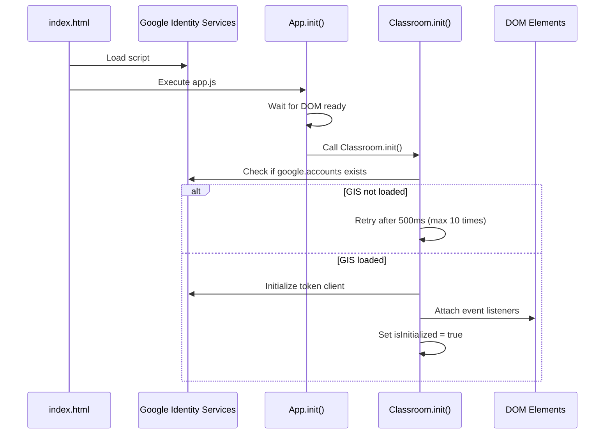

> Original Source: kiro_01/specs/google-classroom-toggle-fix/design.md

# Design Document: Google Classroom Toggle Fix

## Overview

This design addresses the non-functional Google Classroom toggle buttons in the b1t-Sched application. The root cause has been identified as the missing Google Identity Services script in the HTML document, which prevents the Classroom module from properly initializing. Additionally, there may be timing issues with event listener attachment.

The fix involves:
1. Adding the Google Identity Services script tag to index.html
2. Ensuring proper initialization sequence
3. Adding defensive checks for DOM element availability
4. Improving error handling and logging

## Architecture

### Current Architecture

```
index.html
  ├── Firebase SDKs (loaded)
  ├── App JavaScript Modules (loaded)
  │   ├── classroom.js (Classroom module)
  │   └── app.js (calls Classroom.init())
  └── Google Identity Services (MISSING)
```

### Fixed Architecture

```
index.html
  ├── Google Identity Services (NEW - loaded early)
  ├── Firebase SDKs
  └── App JavaScript Modules
      ├── classroom.js (Classroom module with improved checks)
      └── app.js (calls Classroom.init() after DOM ready)
```

### Initialization Flow



## Components and Interfaces

### 1. HTML Script Loading (index.html)

**Location:** Before closing `</body>` tag, before Firebase SDKs

**Change:**
```html
<!-- Google Identity Services (for Classroom OAuth) -->
<script src="https://accounts.google.com/gsi/client" async defer></script>

<!-- Firebase SDKs (CDN) -->
<script src="https://www.gstatic.com/firebasejs/10.7.1/firebase-app-compat.js"></script>
...
```

**Rationale:** The Google Identity Services library must be loaded before the Classroom module attempts to use it. Using `async defer` allows the page to continue loading while the script is fetched.

### 2. Classroom Module Initialization (classroom.js)

**Current Implementation Issues:**
- No retry mechanism if Google Identity Services isn't loaded yet
- Event listeners attached without checking if DOM elements exist
- No logging for debugging

**Improved Implementation:**

```javascript
init() {
    console.log('Initializing Google Classroom module...');

    // Wait for Google Identity Services script to load
    if (typeof google === 'undefined' || !google.accounts || !google.accounts.oauth2) {
        console.warn('Google Identity Services not loaded yet. Retrying in 500ms...');
        
        // Retry up to 10 times
        if (!this.initRetryCount) this.initRetryCount = 0;
        this.initRetryCount++;
        
        if (this.initRetryCount <= 10) {
            setTimeout(() => this.init(), 500);
            return;
        } else {
            console.error('Failed to load Google Identity Services after 10 retries');
            this.renderError('Google Classroom is currently unavailable');
            return;
        }
    }

    // Initialize Token Client
    this.tokenClient = google.accounts.oauth2.initTokenClient({
        client_id: this.CLIENT_ID,
        scope: this.SCOPES,
        callback: (tokenResponse) => {
            if (tokenResponse.error) {
                console.error('Error fetching access token:', tokenResponse);
                this.renderError('Failed to authenticate with Google.');
                return;
            }
            this.accessToken = tokenResponse.access_token;
            console.log('Access token received');
            this.handleAuthSuccess();
        },
    });

    this.setupEventListeners();
    this.isInitialized = true;
    this.renderInitialState();
    console.log('Google Classroom module initialized successfully');
},
```

### 3. Event Listener Setup (classroom.js)

**Current Implementation Issues:**
- No null checks before adding event listeners
- No confirmation logging

**Improved Implementation:**

```javascript
setupEventListeners() {
    console.log('Setting up Classroom event listeners...');
    
    // Mobile Toggle Button
    const toggleBtn = document.getElementById('classroom-toggle');
    if (toggleBtn) {
        console.log('Attaching click listener to mobile toggle button');
        toggleBtn.addEventListener('click', () => {
            console.log('Mobile toggle clicked');
            this.openClassroomParams();
        });
    } else {
        console.warn('Mobile toggle button (classroom-toggle) not found in DOM');
    }

    // Desktop Navigation Button
    const navBtn = document.getElementById('classroom-nav-btn');
    if (navBtn) {
        console.log('Attaching click listener to desktop nav button');
        navBtn.addEventListener('click', (e) => {
            e.preventDefault();
            console.log('Desktop nav button clicked');
            this.openClassroomParams();
        });
    } else {
        console.warn('Desktop nav button (classroom-nav-btn) not found in DOM');
    }

    // Close Buttons
    const closeMobile = document.getElementById('close-classroom-sidebar');
    const closeDesktop = document.getElementById('close-classroom-modal');
    const overlay = document.getElementById('classroom-overlay');

    if (closeMobile) {
        closeMobile.addEventListener('click', () => this.toggleSidebar(false));
    }
    if (closeDesktop) {
        closeDesktop.addEventListener('click', () => this.toggleModal(false));
    }
    if (overlay) {
        overlay.addEventListener('click', () => this.toggleSidebar(false));
    }
    
    console.log('Event listeners setup complete');
},
```

### 4. App Initialization Timing (app.js)

**Current Implementation:**
The app.js already calls `Classroom.init()` in the `App.init()` method, which is good. However, we should ensure this happens after DOM is ready.

**Verification Needed:**
Check if `App.init()` is called after DOMContentLoaded or if it's called immediately.

**Recommended Pattern:**
```javascript
// At the end of app.js
document.addEventListener('DOMContentLoaded', () => {
    App.init();
});
```

## Data Models

No data model changes required. This is a bugfix that restores existing functionality.

## Correctness Properties

*A property is a characteristic or behavior that should hold true across all valid executions of a system—essentially, a formal statement about what the system should do. Properties serve as the bridge between human-readable specifications and machine-verifiable correctness guarantees.*


### Property 1: Google Identity Services Retry Mechanism

*For any* initialization attempt where Google Identity Services is not yet loaded, the system should retry initialization after a 500ms delay, up to a maximum of 10 attempts, and log each retry attempt.

**Validates: Requirements 1.4, 5.3**

### Property 2: Responsive Interface Selection

*For any* button click event, the system should check the current window width and open the mobile sidebar interface when width <= 768px, or open the desktop modal interface when width > 768px.

**Validates: Requirements 2.1, 3.1, 7.1, 7.2, 7.4**

### Property 3: Responsive Button Visibility

*For any* viewport width, the mobile toggle button should be visible only when width <= 768px, and the desktop navigation button should be visible only when width > 768px.

**Validates: Requirements 2.2, 3.2**

### Property 4: Authentication State Conditional Rendering

*For any* classroom interface opening (sidebar or modal), the system should display the authentication interface when the user is not authenticated, or display the course list when the user is authenticated.

**Validates: Requirements 2.3, 2.4, 3.3, 3.4**

### Property 5: Event Listener Attachment with Null Checks

*For any* DOM element that the system attempts to attach an event listener to, the system should first verify the element exists, attach the listener if it exists, or log a warning and continue if it doesn't exist.

**Validates: Requirements 4.1, 4.2, 4.3**

### Property 6: Event Listener Method Invocation

*For any* click event on a classroom toggle button (mobile or desktop), the event listener should call the openClassroomParams() method, and for desktop buttons, should also prevent default link navigation.

**Validates: Requirements 3.5, 4.4**

### Property 7: Comprehensive Logging

*For any* significant classroom module operation (event listener attachment, DOM element lookup, Google Identity Services loading, button clicks, initialization failures), the system should log appropriate messages (info, warning, or error) to the console with relevant context.

**Validates: Requirements 6.1, 6.2, 6.3, 6.4**

### Property 8: Graceful Error Handling

*For any* error condition (missing Google Identity Services after retries, missing DOM elements, authentication failures), the system should display a clear error message in the UI and continue functioning without crashing.

**Validates: Requirements 5.5, 6.5**

### Property 9: Loading State Indication

*For any* asynchronous operation in the classroom interface (fetching courses, fetching assignments, fetching announcements), the system should display a loading indicator until the operation completes or fails.

**Validates: Requirements 8.4**

## Error Handling

### 1. Missing Google Identity Services

**Scenario:** The Google Identity Services script fails to load or is blocked.

**Handling:**
- Retry initialization up to 10 times with 500ms delays
- After all retries fail, log error to console
- Display user-friendly error message: "Google Classroom is currently unavailable. Please check your internet connection and refresh the page."
- Disable classroom toggle buttons (add disabled class, remove event listeners)

### 2. Missing DOM Elements

**Scenario:** Toggle buttons or other required DOM elements are not present in the HTML.

**Handling:**
- Log warning to console with element ID
- Continue initialization for other elements
- Module remains functional for elements that do exist

### 3. Authentication Failures

**Scenario:** User denies OAuth permission or authentication fails.

**Handling:**
- Display error message in classroom interface
- Provide "Try Again" button to re-attempt authentication
- Log error details to console for debugging

### 4. API Request Failures

**Scenario:** Google Classroom API requests fail (network error, permission denied, etc.).

**Handling:**
- Display error message in classroom interface
- Provide retry button
- Log error details to console
- Maintain UI state (don't crash or show blank screen)

## Testing Strategy

### Unit Tests

Unit tests should focus on specific examples and edge cases:

1. **Script Tag Presence** - Verify index.html contains the Google Identity Services script tag
2. **Initialization Sequence** - Verify Classroom.init() is called after DOM ready
3. **Null Check Logic** - Verify setupEventListeners() contains null checks for each element
4. **CSS Cursor Styling** - Verify toggle buttons have cursor: pointer in CSS
5. **Error Message Content** - Verify error messages are clear and user-friendly

### Property-Based Tests

Property tests should verify universal properties across all inputs. Each test should run a minimum of 100 iterations.

**Test Configuration:**
- Use a JavaScript property-based testing library (e.g., fast-check for JavaScript/TypeScript)
- Minimum 100 iterations per property test
- Each test tagged with: **Feature: google-classroom-toggle-fix, Property {number}: {property_text}**

**Property Test Cases:**

1. **Property 1: Retry Mechanism**
   - Generate random states where google.accounts is undefined
   - Verify retry count increments and delays occur
   - Verify error logged after 10 retries

2. **Property 2: Responsive Interface Selection**
   - Generate random window widths (100px to 2000px)
   - Simulate button clicks
   - Verify correct interface opens based on width

3. **Property 3: Responsive Button Visibility**
   - Generate random window widths
   - Verify mobile button visible only when width <= 768px
   - Verify desktop button visible only when width > 768px

4. **Property 4: Authentication State Rendering**
   - Generate random authentication states (authenticated/not authenticated)
   - Open classroom interface
   - Verify correct UI rendered based on auth state

5. **Property 5: Event Listener Null Checks**
   - Generate random DOM states (elements present/missing)
   - Call setupEventListeners()
   - Verify no errors thrown, warnings logged for missing elements

6. **Property 6: Event Listener Method Invocation**
   - Generate random click events on toggle buttons
   - Verify openClassroomParams() is called
   - Verify preventDefault() called for desktop button

7. **Property 7: Comprehensive Logging**
   - Generate random operations (init, attach listeners, click buttons)
   - Verify appropriate log messages generated
   - Verify log messages contain relevant context

8. **Property 8: Graceful Error Handling**
   - Generate random error conditions
   - Verify error messages displayed in UI
   - Verify system continues functioning

9. **Property 9: Loading State Indication**
   - Generate random async operations
   - Verify loading indicator displayed during operation
   - Verify loading indicator removed after completion

### Integration Tests

Integration tests should verify the complete flow:

1. **End-to-End Toggle Flow (Mobile)**
   - Set viewport to mobile size
   - Click mobile toggle button
   - Verify sidebar opens
   - Verify authentication interface or course list displayed

2. **End-to-End Toggle Flow (Desktop)**
   - Set viewport to desktop size
   - Click desktop navigation button
   - Verify modal opens
   - Verify authentication interface or course list displayed

3. **Responsive Resize Flow**
   - Start at mobile viewport
   - Click toggle (verify sidebar opens)
   - Resize to desktop viewport
   - Click toggle (verify modal opens instead)

### Manual Testing Checklist

Some aspects require manual verification:

- [ ] Toggle buttons have visible hover states
- [ ] Toggle buttons provide tactile feedback on click
- [ ] Touch targets are appropriately sized on mobile (minimum 44x44px)
- [ ] Toggle buttons are not obscured by other UI elements
- [ ] Error messages are clear and actionable
- [ ] Loading indicators are visible and smooth
- [ ] Cross-browser compatibility (Chrome, Firefox, Safari, Edge)

## Implementation Notes

### Priority Order

1. **Critical (Must Fix):**
   - Add Google Identity Services script tag to index.html
   - Add null checks to setupEventListeners()
   - Add retry logic to init()

2. **Important (Should Fix):**
   - Add comprehensive logging
   - Improve error messages
   - Add loading state indicators

3. **Nice to Have:**
   - Add disabled state for buttons when classroom unavailable
   - Add retry buttons in error states

### Backward Compatibility

All changes should maintain backward compatibility:
- Existing classroom functionality should continue to work
- No breaking changes to the Classroom module API
- CSS classes and IDs should remain unchanged

### Performance Considerations

- Google Identity Services script loaded with `async defer` to avoid blocking page load
- Retry delays (500ms) are reasonable and won't significantly impact UX
- Event listeners attached once during initialization, not repeatedly

### Security Considerations

- OAuth flow remains unchanged (secure)
- No sensitive data logged to console
- Error messages don't expose internal implementation details

## Deployment Plan

1. **Development:**
   - Make changes to index.html and classroom.js
   - Test locally with browser dev tools

2. **Testing:**
   - Run unit tests
   - Run property-based tests
   - Perform manual testing on mobile and desktop
   - Test with Google Identity Services blocked (verify error handling)

3. **Staging:**
   - Deploy to staging environment
   - Verify Google Identity Services loads correctly
   - Test with real Google Classroom accounts

4. **Production:**
   - Deploy during low-traffic period
   - Monitor console logs for errors
   - Verify toggle buttons working for users

## Rollback Plan

If issues arise after deployment:

1. **Immediate:** Revert index.html and classroom.js to previous versions
2. **Investigation:** Check browser console logs for errors
3. **Fix:** Address specific issues identified
4. **Redeploy:** After thorough testing

The changes are minimal and low-risk, so rollback should be straightforward.
