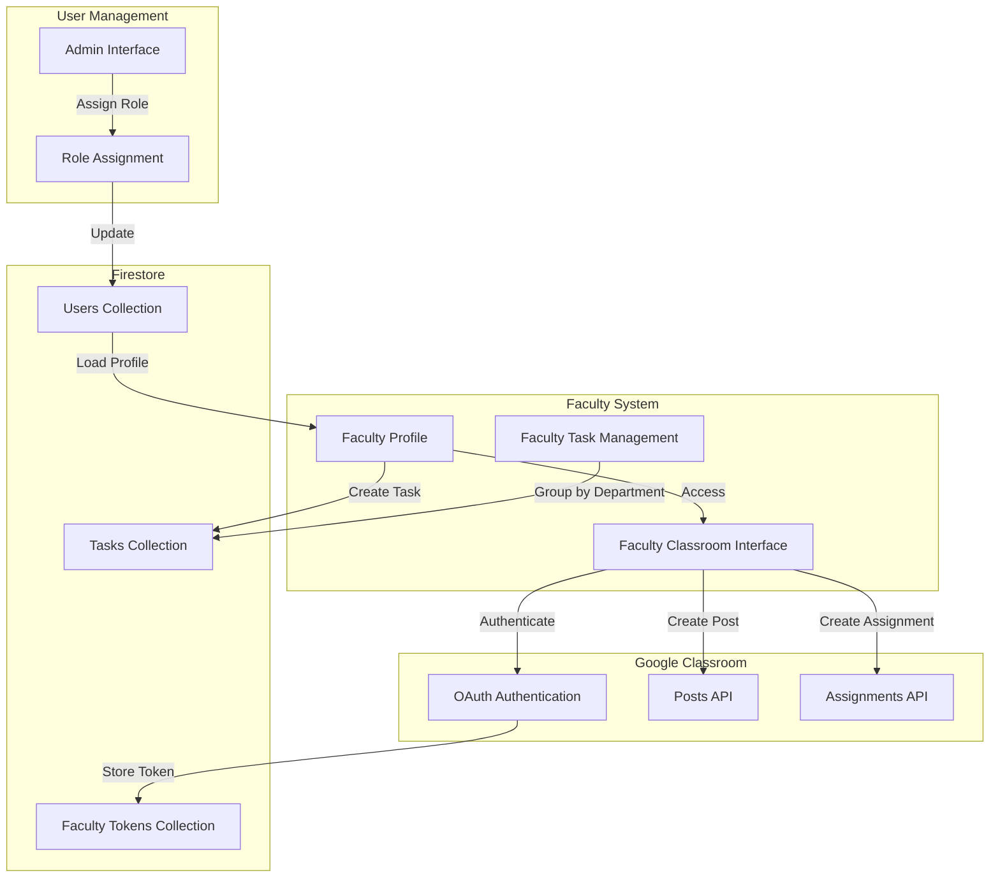
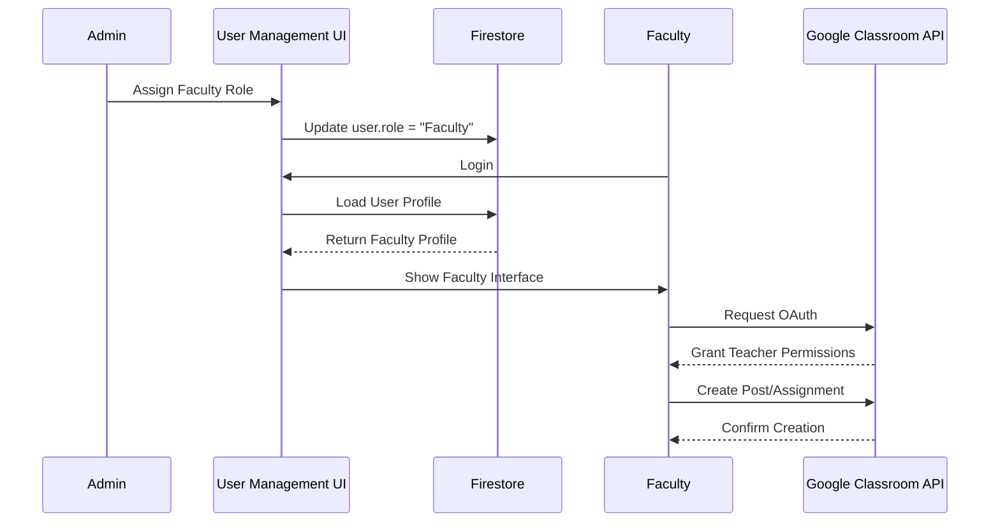

# Design Document: Faculty Role and Privileges

## Overview

This design implements a new "Faculty" role in the web application, providing teaching staff with elevated privileges and a specialized interface for creating content in Google Classroom. Faculty users are organized by department rather than semester/section, and they have access to content creation features that are not available to Student or CR users.

Key features:
- New Faculty role assignable by admins through User Management interface
- Department-based organization for Faculty users (no semester/section requirements)
- Modified Profile Settings UI with readonly semester/section fields for Faculty
- Specialized Google Classroom interface for Faculty with content creation capabilities
- Google Classroom API integration for creating posts and assignments
- OAuth authentication with teacher-level permissions for Faculty users

## Architecture

### High-Level Architecture



### Component Interaction Flow



## Components and Interfaces

### 1. Role Management Component

**Purpose:** Handles Faculty role assignment and validation through the admin interface.

**Interface:**
```javascript
class RoleManager {
  /**
   * Assigns Faculty role to a user
   * @param {string} userId - Target user ID
   * @param {string} adminId - Admin performing the action
   * @returns {Promise<{success: boolean, error?: string}>}
   */
  async assignFacultyRole(userId, adminId)
  
  /**
   * Removes Faculty role from a user
   * @param {string} userId - Target user ID
   * @param {string} adminId - Admin performing the action
   * @returns {Promise<{success: boolean, error?: string}>}
   */
  async removeFacultyRole(userId, adminId)
  
  /**
   * Checks if user has Faculty role
   * @param {string} userId - User ID to check
   * @returns {Promise<boolean>}
   */
  async isFaculty(userId)
  
  /**
   * Validates admin permissions for role assignment
   * @param {string} adminId - Admin user ID
   * @returns {Promise<boolean>}
   */
  async validateAdminPermission(adminId)
}
```

### 2. Faculty Profile Manager

**Purpose:** Manages Faculty-specific profile settings and UI adaptations.

**Interface:**
```javascript
class FacultyProfileManager {
  /**
   * Loads Faculty profile with department-only organization
   * @param {string} userId - Faculty user ID
   * @returns {Promise<{success: boolean, data?: object, error?: string}>}
   */
  async loadFacultyProfile(userId)
  
  /**
   * Updates Faculty profile (department only)
   * @param {string} userId - Faculty user ID
   * @param {object} updates - Profile updates
   * @returns {Promise<{success: boolean, error?: string}>}
   */
  async updateFacultyProfile(userId, updates)
  
  /**
   * Renders Faculty profile UI with readonly semester/section
   * @param {object} profile - Faculty profile data
   */
  renderFacultyProfileUI(profile)
  
  /**
   * Validates Faculty profile data
   * @param {object} profile - Profile to validate
   * @returns {{valid: boolean, errors: string[]}}
   */
  validateFacultyProfile(profile)
}
```

### 3. Faculty Task Manager

**Purpose:** Handles task creation and grouping for Faculty users by department.

**Interface:**
```javascript
class FacultyTaskManager {
  /**
   * Creates a task associated with Faculty user's department
   * @param {string} facultyId - Faculty user ID
   * @param {object} taskData - Task information
   * @returns {Promise<{success: boolean, taskId?: string, error?: string}>}
   */
  async createFacultyTask(facultyId, taskData)
  
  /**
   * Fetches tasks grouped by department for Faculty view
   * @param {string} department - Department to filter by
   * @returns {Promise<{success: boolean, tasks?: array, error?: string}>}
   */
  async getFacultyTasksByDepartment(department)
  
  /**
   * Updates a Faculty-created task
   * @param {string} taskId - Task ID
   * @param {string} facultyId - Faculty user ID
   * @param {object} updates - Task updates
   * @returns {Promise<{success: boolean, error?: string}>}
   */
  async updateFacultyTask(taskId, facultyId, updates)
  
  /**
   * Checks if Faculty user can edit a task
   * @param {string} taskId - Task ID
   * @param {string} facultyId - Faculty user ID
   * @returns {Promise<boolean>}
   */
  async canEditTask(taskId, facultyId)
}
```

### 4. Faculty Classroom Interface

**Purpose:** Provides Faculty-specific Google Classroom UI with content creation capabilities.

**Interface:**
```javascript
class FacultyClassroomInterface {
  /**
   * Initializes Faculty Classroom interface
   * @param {string} facultyId - Faculty user ID
   * @returns {Promise<{success: boolean, error?: string}>}
   */
  async init(facultyId)
  
  /**
   * Renders Faculty Classroom UI with creation controls
   */
  renderFacultyInterface()
  
  /**
   * Shows post creation form
   */
  showPostCreationForm()
  
  /**
   * Shows assignment creation form
   */
  showAssignmentCreationForm()
  
  /**
   * Handles post creation submission
   * @param {object} postData - Post information
   * @returns {Promise<{success: boolean, postId?: string, error?: string}>}
   */
  async createPost(postData)
  
  /**
   * Handles assignment creation submission
   * @param {object} assignmentData - Assignment information
   * @returns {Promise<{success: boolean, assignmentId?: string, error?: string}>}
   */
  async createAssignment(assignmentData)
  
  /**
   * Validates post data before submission
   * @param {object} postData - Post to validate
   * @returns {{valid: boolean, errors: string[]}}
   */
  validatePostData(postData)
  
  /**
   * Validates assignment data before submission
   * @param {object} assignmentData - Assignment to validate
   * @returns {{valid: boolean, errors: string[]}}
   */
  validateAssignmentData(assignmentData)
}
```

### 5. Google Classroom API Manager (Faculty)

**Purpose:** Manages Google Classroom API interactions for Faculty users with teacher permissions.

**Interface:**
```javascript
class FacultyClassroomAPIManager {
  /**
   * Authenticates Faculty user with teacher-level permissions
   * @param {string} facultyId - Faculty user ID
   * @returns {Promise<{success: boolean, token?: string, error?: string}>}
   */
  async authenticateFaculty(facultyId)
  
  /**
   * Creates a post in Google Classroom
   * @param {string} courseId - Course ID
   * @param {object} postData - Post content
   * @param {string} accessToken - OAuth token
   * @returns {Promise<{success: boolean, post?: object, error?: string}>}
   */
  async createClassroomPost(courseId, postData, accessToken)
  
  /**
   * Creates an assignment in Google Classroom
   * @param {string} courseId - Course ID
   * @param {object} assignmentData - Assignment content
   * @param {string} accessToken - OAuth token
   * @returns {Promise<{success: boolean, assignment?: object, error?: string}>}
   */
  async createClassroomAssignment(courseId, assignmentData, accessToken)
  
  /**
   * Refreshes expired OAuth token
   * @param {string} refreshToken - Refresh token
   * @returns {Promise<{success: boolean, accessToken?: string, error?: string}>}
   */
  async refreshAccessToken(refreshToken)
  
  /**
   * Stores Faculty OAuth tokens securely
   * @param {string} facultyId - Faculty user ID
   * @param {object} tokens - OAuth tokens
   * @returns {Promise<{success: boolean, error?: string}>}
   */
  async storeFacultyTokens(facultyId, tokens)
  
  /**
   * Retrieves Faculty OAuth tokens
   * @param {string} facultyId - Faculty user ID
   * @returns {Promise<{success: boolean, tokens?: object, error?: string}>}
   */
  async getFacultyTokens(facultyId)
}
```

## Data Models

### User Document (users/{userId})

```javascript
{
  uid: string,
  email: string,
  name: string,
  department: string,
  semester: string,          // Optional for Faculty (null or "N/A")
  section: string,           // Optional for Faculty (null or "N/A")
  role: string,              // "Student", "CR", "Admin", or "Faculty"
  isAdmin: boolean,          // Deprecated, use role field
  isCR: boolean,             // Deprecated, use role field
  isFaculty: boolean,        // New field for Faculty role
  isBlocked: boolean,
  lastProfileChange: timestamp,
  createdAt: timestamp
}
```

### Task Document (tasks/{taskId})

```javascript
{
  title: string,
  description: string,
  details: string,
  deadline: timestamp,
  department: string,
  semester: string,          // Optional for Faculty tasks
  section: string,           // Optional for Faculty tasks
  addedBy: string,           // User ID
  addedByName: string,
  addedByRole: string,       // "Student", "CR", "Admin", or "Faculty"
  createdAt: timestamp,
  updatedAt: timestamp
}
```

### Faculty Token Document (facultyTokens/{facultyId})

```javascript
{
  facultyId: string,
  accessToken: string,       // Encrypted OAuth access token
  refreshToken: string,      // Encrypted OAuth refresh token
  expiresAt: timestamp,
  scope: string,             // OAuth scopes granted
  grantedAt: timestamp,
  lastUsed: timestamp
}
```

### Google Classroom Post Data

```javascript
{
  courseId: string,
  text: string,              // Post content
  materials: array,          // Optional attachments
  state: string,             // "PUBLISHED" or "DRAFT"
  scheduledTime: timestamp   // Optional scheduled publish time
}
```

### Google Classroom Assignment Data

```javascript
{
  courseId: string,
  title: string,
  description: string,
  materials: array,          // Optional attachments
  maxPoints: number,
  dueDate: {
    year: number,
    month: number,
    day: number
  },
  dueTime: {
    hours: number,
    minutes: number
  },
  workType: string,          // "ASSIGNMENT", "SHORT_ANSWER_QUESTION", etc.
  submissionModificationMode: string,
  state: string              // "PUBLISHED" or "DRAFT"
}
```

## Correctness Properties

*A property is a characteristic or behavior that should hold true across all valid executions of a system—essentially, a formal statement about what the system should do. Properties serve as the bridge between human-readable specifications and machine-verifiable correctness guarantees.*

### Property 1: Faculty Role Assignment Authorization

*For any* role assignment operation, if the requesting user is not an admin, the operation should be rejected and the target user's role should remain unchanged.

**Validates: Requirements 1.4**

### Property 2: Faculty Role Persistence

*For any* Faculty user, after role assignment and across all sessions, the user's role field should consistently return "Faculty" or isFaculty should return true.

**Validates: Requirements 1.3**

### Property 3: Faculty Task Department Association

*For any* task created by a Faculty user, the task should be associated with the Faculty user's department field.

**Validates: Requirements 3.1**

### Property 4: Faculty Profile Semester/Section Readonly

*For any* Faculty user accessing Profile Settings, the semester and section fields should be rendered as readonly or display "Not Available For Faculty".

**Validates: Requirements 4.1, 4.2**

### Property 5: Faculty Profile Department Editability

*For any* Faculty user accessing Profile Settings, the department field should be editable and updates should be persisted to Firestore.

**Validates: Requirements 4.3**

### Property 6: Faculty Classroom Interface Differentiation

*For any* Faculty user accessing the Google Classroom section, the interface should display content creation controls (post and assignment creation).

**Validates: Requirements 5.1, 5.2, 5.3**

### Property 7: Non-Faculty Classroom Interface Restriction

*For any* non-Faculty user (Student, CR) accessing the Google Classroom section, the interface should display the standard read-only interface without creation controls.

**Validates: Requirements 5.4**

### Property 8: Google Classroom Post Creation Success

*For any* valid post data submitted by a Faculty user with valid authentication, the system should successfully create the post via Google Classroom API and return a success confirmation.

**Validates: Requirements 6.1, 6.2**

### Property 9: Google Classroom Assignment Creation Success

*For any* valid assignment data submitted by a Faculty user with valid authentication, the system should successfully create the assignment via Google Classroom API and return a success confirmation.

**Validates: Requirements 7.1, 7.2**

### Property 10: Faculty OAuth Teacher Permissions

*For any* Faculty user authenticating with Google Classroom API, the system should request and receive teacher-level permissions that allow content creation.

**Validates: Requirements 8.2**

### Property 11: Faculty Task Edit Authorization

*For any* task edit operation, if the task was created by a Faculty user, only that Faculty user or an admin should be able to edit the task.

**Validates: Requirements 9.1**

### Property 12: Faculty UI Role-Based Rendering

*For any* UI component rendered for a Faculty user, the system should check the user's role and conditionally display Faculty-specific controls and hide semester/section filters.

**Validates: Requirements 10.4, 10.5**

## Error Handling

### Role Assignment Errors

**Error Scenario:** Non-admin user attempts to assign Faculty role.

**Handling Strategy:**
- Check admin status before processing role assignment
- Return error message: "You do not have permission to assign roles"
- Log unauthorized attempt with user ID and timestamp
- Do not modify target user's role

**Implementation:**
```javascript
async function assignFacultyRole(userId, adminId) {
  const isAdmin = await RoleManager.validateAdminPermission(adminId);
  if (!isAdmin) {
    console.warn(`Unauthorized role assignment attempt by ${adminId}`);
    return { success: false, error: "You do not have permission to assign roles" };
  }
  // Proceed with role assignment
}
```

### Profile Update Errors

**Error Scenario:** Faculty user attempts to update semester or section fields.

**Handling Strategy:**
- Validate that Faculty users are not updating semester/section
- Return error message: "Faculty users cannot modify semester or section"
- Allow department updates to proceed
- Log validation failure

**Implementation:**
```javascript
async function updateFacultyProfile(userId, updates) {
  if (updates.semester || updates.section) {
    return { 
      success: false, 
      error: "Faculty users cannot modify semester or section fields" 
    };
  }
  // Proceed with department update
}
```

### Google Classroom Authentication Errors

**Error Scenario:** Faculty user's OAuth authentication fails or is denied.

**Handling Strategy:**
- Display user-friendly error message
- Provide retry button
- Log authentication failure with error code
- Do not store invalid tokens
- Show instructions for granting permissions

**Implementation:**
```javascript
async function authenticateFaculty(facultyId) {
  try {
    const tokenResponse = await requestOAuthToken();
    if (tokenResponse.error) {
      console.error('OAuth error:', tokenResponse.error);
      return {
        success: false,
        error: "Authentication failed. Please try again and grant the required permissions."
      };
    }
    return { success: true, token: tokenResponse.access_token };
  } catch (error) {
    console.error('Authentication exception:', error);
    return {
      success: false,
      error: "Unable to connect to Google Classroom. Please check your internet connection."
    };
  }
}
```

### Google Classroom API Errors

**Error Scenario:** Post or assignment creation fails due to API error.

**Handling Strategy:**
- Parse API error response for specific error codes
- Display descriptive error messages based on error type
- Common errors:
  - 401: Token expired → Trigger re-authentication
  - 403: Insufficient permissions → Show permission instructions
  - 404: Course not found → Verify course selection
  - 429: Rate limit exceeded → Show retry message with delay
- Log API errors with full context
- Do not expose raw API errors to users

**Implementation:**
```javascript
async function createClassroomPost(courseId, postData, accessToken) {
  try {
    const response = await fetch(
      `https://classroom.googleapis.com/v1/courses/${courseId}/announcements`,
      {
        method: 'POST',
        headers: {
          'Authorization': `Bearer ${accessToken}`,
          'Content-Type': 'application/json'
        },
        body: JSON.stringify(postData)
      }
    );
    
    if (!response.ok) {
      const errorData = await response.json();
      console.error('API error:', errorData);
      
      if (response.status === 401) {
        return { success: false, error: "Session expired. Please sign in again.", needsAuth: true };
      } else if (response.status === 403) {
        return { success: false, error: "Insufficient permissions. Please grant teacher access." };
      } else if (response.status === 404) {
        return { success: false, error: "Course not found. Please select a valid course." };
      } else if (response.status === 429) {
        return { success: false, error: "Too many requests. Please wait a moment and try again." };
      }
      
      return { success: false, error: "Failed to create post. Please try again." };
    }
    
    const post = await response.json();
    return { success: true, post };
  } catch (error) {
    console.error('Network error:', error);
    return { success: false, error: "Network error. Please check your connection." };
  }
}
```

### Token Expiration

**Error Scenario:** Faculty user's OAuth token expires during operation.

**Handling Strategy:**
- Detect 401 errors from Google Classroom API
- Attempt automatic token refresh using refresh token
- If refresh fails, prompt user to re-authenticate
- Store new tokens after successful refresh
- Retry original operation with new token

**Implementation:**
```javascript
async function handleTokenExpiration(facultyId, operation) {
  const tokens = await getFacultyTokens(facultyId);
  
  if (!tokens.refreshToken) {
    return { success: false, error: "Please sign in again.", needsAuth: true };
  }
  
  const refreshResult = await refreshAccessToken(tokens.refreshToken);
  
  if (!refreshResult.success) {
    return { success: false, error: "Session expired. Please sign in again.", needsAuth: true };
  }
  
  await storeFacultyTokens(facultyId, {
    accessToken: refreshResult.accessToken,
    refreshToken: tokens.refreshToken,
    expiresAt: Date.now() + (3600 * 1000) // 1 hour
  });
  
  // Retry operation with new token
  return await operation(refreshResult.accessToken);
}
```

### Validation Errors

**Error Scenario:** Faculty user submits invalid post or assignment data.

**Handling Strategy:**
- Validate all required fields before API call
- Display field-specific error messages
- Highlight invalid fields in the UI
- Prevent submission until validation passes
- Common validations:
  - Title: Required, max 1000 characters
  - Description: Optional, max 30000 characters
  - Due date: Must be in the future
  - Points: Must be positive number

**Implementation:**
```javascript
function validateAssignmentData(data) {
  const errors = [];
  
  if (!data.title || data.title.trim().length === 0) {
    errors.push("Title is required");
  } else if (data.title.length > 1000) {
    errors.push("Title must be 1000 characters or less");
  }
  
  if (data.description && data.description.length > 30000) {
    errors.push("Description must be 30000 characters or less");
  }
  
  if (data.dueDate) {
    const dueDate = new Date(data.dueDate.year, data.dueDate.month - 1, data.dueDate.day);
    if (dueDate < new Date()) {
      errors.push("Due date must be in the future");
    }
  }
  
  if (data.maxPoints !== undefined && data.maxPoints < 0) {
    errors.push("Points must be a positive number");
  }
  
  return {
    valid: errors.length === 0,
    errors
  };
}
```

### Department Filter Errors

**Error Scenario:** Faculty tasks are not properly filtered by department.

**Handling Strategy:**
- Ensure all Faculty tasks have department field set
- Default to Faculty user's department if not specified
- Log tasks with missing department field
- Display warning to Faculty user if department is missing
- Provide UI to set department for existing tasks

## Testing Strategy

### Dual Testing Approach

This feature requires both unit tests and property-based tests:

- **Unit tests**: Verify specific examples, edge cases, and error conditions
- **Property tests**: Verify universal properties across all inputs

Both approaches are complementary and necessary for comprehensive coverage.

### Unit Testing Focus

Unit tests should focus on:

**Specific examples that demonstrate correct behavior:**
- Admin assigns Faculty role to a user
- Faculty user creates a task associated with their department
- Faculty user accesses Profile Settings and sees readonly semester/section
- Faculty user authenticates with Google Classroom API
- Faculty user creates a post in Google Classroom
- Faculty user creates an assignment in Google Classroom

**Integration points between components:**
- Role Manager integration with Firestore
- Faculty Profile Manager integration with UI rendering
- Faculty Classroom Interface integration with Google Classroom API
- OAuth token storage and retrieval from Firestore

**Edge cases and error conditions:**
- Non-admin attempts to assign Faculty role (should be denied)
- Faculty user attempts to edit semester/section (should be prevented)
- OAuth authentication failure (should show error and retry option)
- Google Classroom API returns 401 (should trigger re-authentication)
- Google Classroom API returns 403 (should show permission error)
- Token expiration during operation (should refresh and retry)
- Invalid assignment data submission (should show validation errors)

### Property-Based Testing Focus

Property tests should focus on:

**Universal properties that hold for all inputs:**
- Role assignment authorization across all user combinations
- Faculty profile field restrictions across all profile updates
- Task department association across all Faculty-created tasks
- UI rendering based on role across all user types

**Property Test Configuration:**
- Minimum 100 iterations per property test
- Each property test must reference its design document property
- Tag format: **Feature: faculty-role-privileges, Property {number}: {property_text}**

**Example Property Tests:**

**Feature: faculty-role-privileges, Property 1: Faculty Role Assignment Authorization**
- Generate random users with different roles
- Attempt role assignments from each user
- Verify only admins can assign Faculty role

**Feature: faculty-role-privileges, Property 3: Faculty Task Department Association**
- Generate random Faculty users with different departments
- Create tasks from each Faculty user
- Verify all tasks have correct department association

**Feature: faculty-role-privileges, Property 7: Non-Faculty Classroom Interface Restriction**
- Generate random users with Student and CR roles
- Render Google Classroom interface for each
- Verify no creation controls are displayed

**Feature: faculty-role-privileges, Property 12: Faculty UI Role-Based Rendering**
- Generate random UI components and user roles
- Render components for each user type
- Verify Faculty-specific controls appear only for Faculty users

### Testing Tools

**Recommended Testing Framework:**
- **JavaScript**: Jest with firebase-mock for Firestore mocking
- **Property-Based Testing Library**: fast-check (JavaScript)

**Mocking Requirements:**
- Mock Firestore SDK (firebase/firestore)
- Mock Google Classroom API endpoints
- Mock OAuth authentication flow
- Mock localStorage for token storage

### Test Coverage Goals

- Unit test coverage: 80%+ of code paths
- Property test coverage: All 12 correctness properties implemented
- Edge case coverage: All error scenarios in Error Handling section
- Integration test coverage: End-to-end flows (role assignment → profile → task creation → Classroom integration)

## Implementation Notes

### Google Classroom API Scopes

Faculty users require the following OAuth scopes:
- `https://www.googleapis.com/auth/classroom.courses.readonly` - Read course information
- `https://www.googleapis.com/auth/classroom.announcements` - Create and manage announcements
- `https://www.googleapis.com/auth/classroom.coursework.students` - Create and manage assignments

### Security Considerations

- OAuth tokens must be encrypted before storing in Firestore
- Use Firestore security rules to restrict token access to token owner and admins
- Implement token rotation and expiration handling
- Log all Faculty role assignments for audit trail
- Validate all API inputs to prevent injection attacks

### UI/UX Considerations

- Clearly distinguish Faculty interface from Student interface
- Provide helpful tooltips and guidance for content creation
- Show loading states during API operations
- Display success confirmations after creating posts/assignments
- Provide easy access to created content in Google Classroom

### Migration Strategy

For existing users being assigned Faculty role:
1. Update user document with `role: "Faculty"` and `isFaculty: true`
2. Set semester and section to null or "N/A"
3. Preserve department field
4. Notify user of role change via email or in-app notification
5. Provide onboarding guide for Faculty features
