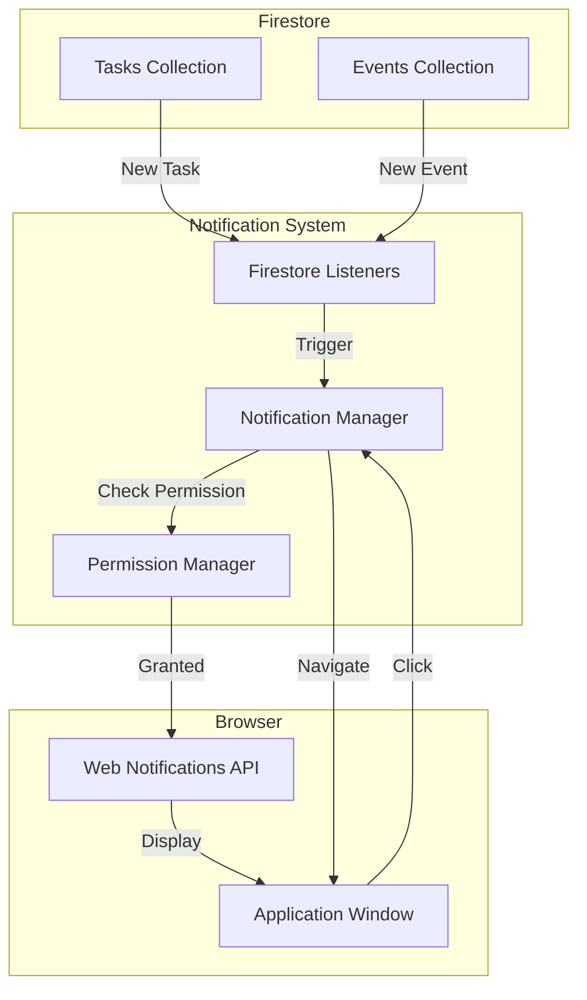
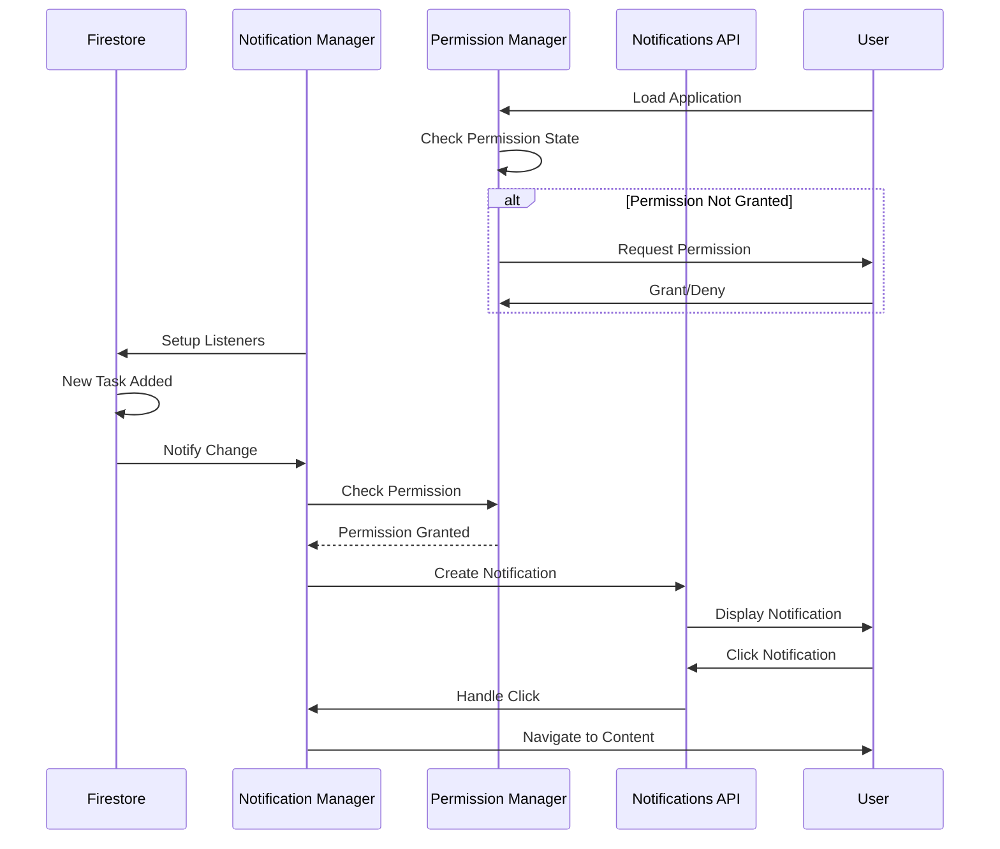
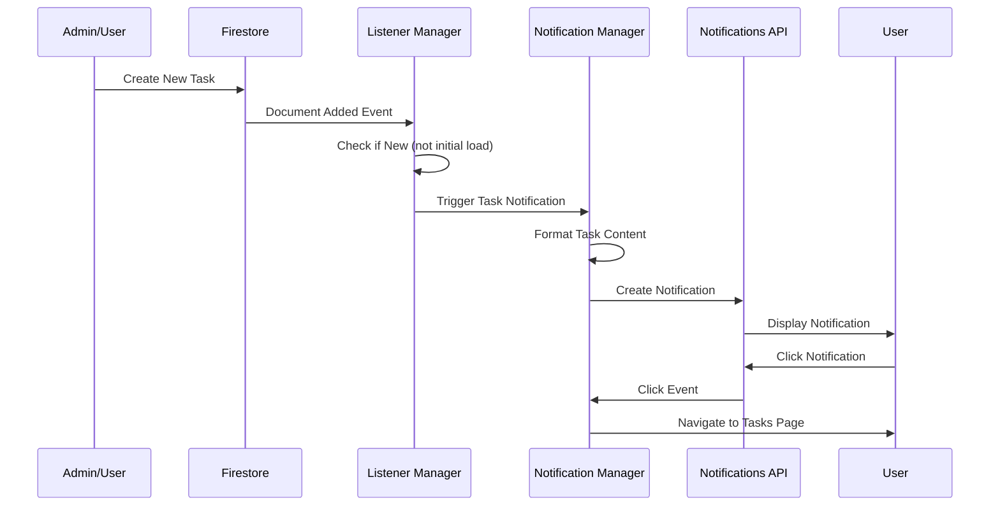
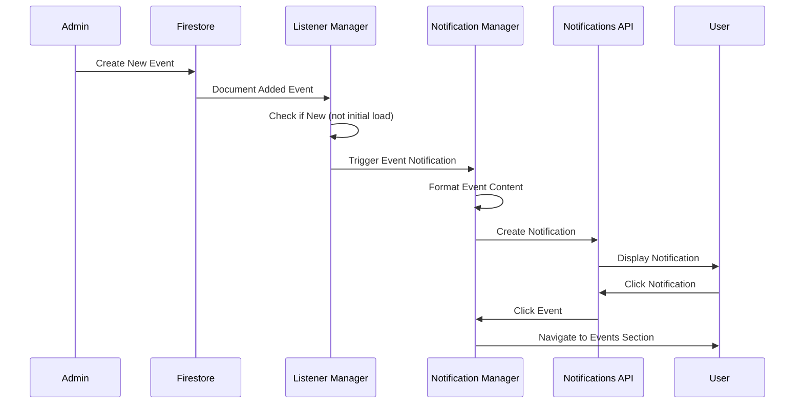
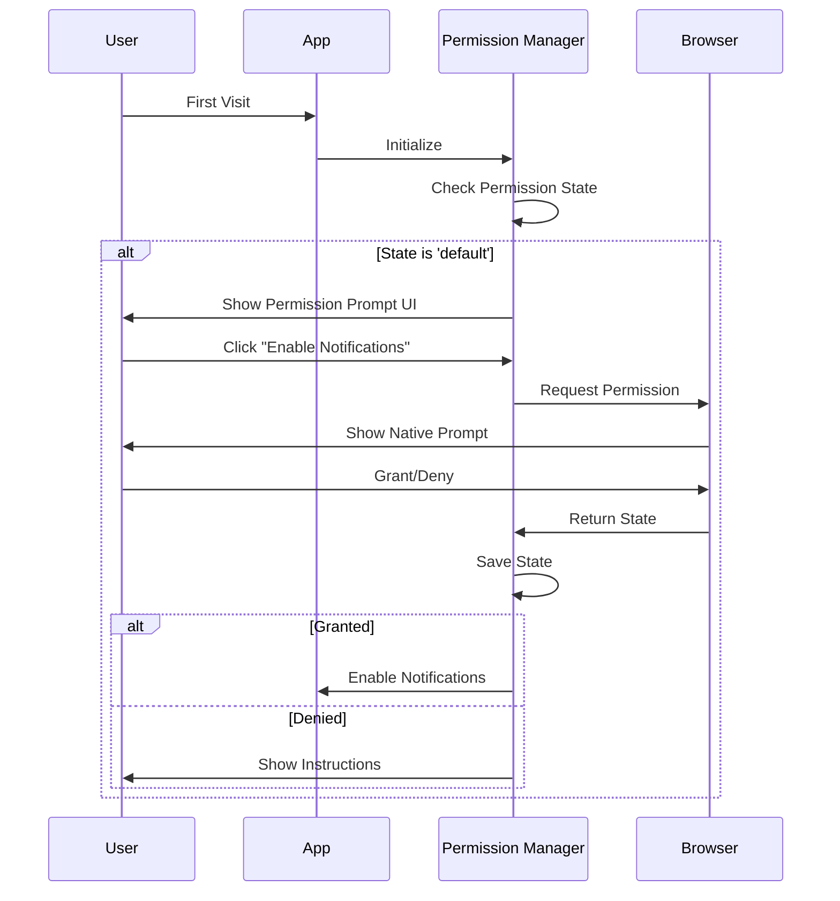

# Design Document: Push Notifications System

## Overview

This design implements a browser-based push notifications system that delivers real-time alerts when new tasks or events are added to the Firestore database. The system leverages the Web Notifications API and Firestore real-time listeners to provide instant feedback to users across both browser and PWA contexts.

The implementation integrates seamlessly with the existing Firebase/Firestore infrastructure and PWA setup, ensuring notifications work reliably whether the user is actively viewing the application or has it running in the background.

Key features:
- Real-time detection of new tasks and events via Firestore listeners
- Browser notifications with rich content (title, description, time)
- Permission management with user-friendly prompts
- Cross-context support (browser and PWA)
- Click-to-navigate functionality
- Graceful error handling and fallbacks

## Architecture

### High-Level Architecture




### Component Interaction Flow



## Components and Interfaces

### 1. Notification Manager

**Purpose:** Core component that manages notification lifecycle, content generation, and user interactions.

**Interface:**
```javascript
class NotificationManager {
  /**
   * Initializes the notification system
   * @returns {Promise<{success: boolean, error?: string}>}
   */
  async init()
  
  /**
   * Shows a notification for a new task
   * @param {object} task - Task data from Firestore
   * @returns {Promise<Notification|null>}
   */
  async showTaskNotification(task)
  
  /**
   * Shows a notification for a new event
   * @param {object} event - Event data from Firestore
   * @returns {Promise<Notification|null>}
   */
  async showEventNotification(event)
  
  /**
   * Handles notification click events
   * @param {string} type - 'task' or 'event'
   * @param {string} id - Document ID
   */
  handleNotificationClick(type, id)
  
  /**
   * Formats notification content to fit size constraints
   * @param {string} content - Raw content
   * @param {number} maxLength - Maximum character length
   * @returns {string}
   */
  formatContent(content, maxLength)
  
  /**
   * Checks if notifications are supported
   * @returns {boolean}
   */
  isSupported()
}
```


### 2. Permission Manager

**Purpose:** Manages notification permission state and user interactions with permission requests.

**Interface:**
```javascript
class PermissionManager {
  /**
   * Requests notification permission from the user
   * @returns {Promise<{granted: boolean, state: string}>}
   */
  async requestPermission()
  
  /**
   * Gets current permission state
   * @returns {string} 'granted', 'denied', or 'default'
   */
  getPermissionState()
  
  /**
   * Checks if permission is granted
   * @returns {boolean}
   */
  isGranted()
  
  /**
   * Shows permission prompt UI
   */
  showPermissionPrompt()
  
  /**
   * Hides permission prompt UI
   */
  hidePermissionPrompt()
  
  /**
   * Saves user's permission decision
   * @param {string} state - Permission state
   */
  savePermissionState(state)
  
  /**
   * Provides instructions for enabling notifications in browser settings
   * @returns {string}
   */
  getEnableInstructions()
}
```

### 3. Firestore Listener Manager

**Purpose:** Sets up and manages real-time listeners on Firestore collections to detect new documents.

**Interface:**
```javascript
class FirestoreListenerManager {
  /**
   * Initializes listeners for tasks and events
   * @param {object} userProfile - User's department, semester, section
   * @returns {Promise<{success: boolean}>}
   */
  async setupListeners(userProfile)
  
  /**
   * Sets up listener for new tasks
   * @param {string} department
   * @param {string} semester
   * @param {string} section
   * @param {function} callback - Called when new task is detected
   * @returns {function} Unsubscribe function
   */
  listenForNewTasks(department, semester, section, callback)
  
  /**
   * Sets up listener for new events
   * @param {string} department
   * @param {function} callback - Called when new event is detected
   * @returns {function} Unsubscribe function
   */
  listenForNewEvents(department, callback)
  
  /**
   * Removes all active listeners
   */
  unsubscribeAll()
  
  /**
   * Checks if a document is truly new (not from initial load)
   * @param {object} change - Firestore document change
   * @returns {boolean}
   */
  isNewDocument(change)
}
```


### 4. Notification Content Formatter

**Purpose:** Formats task and event data into notification-friendly content.

**Interface:**
```javascript
class NotificationContentFormatter {
  /**
   * Formats task data for notification
   * @param {object} task - Task document from Firestore
   * @returns {{title: string, body: string, icon: string, data: object}}
   */
  formatTaskNotification(task)
  
  /**
   * Formats event data for notification
   * @param {object} event - Event document from Firestore
   * @returns {{title: string, body: string, icon: string, data: object}}
   */
  formatEventNotification(event)
  
  /**
   * Truncates text with ellipsis
   * @param {string} text
   * @param {number} maxLength
   * @returns {string}
   */
  truncate(text, maxLength)
  
  /**
   * Formats date/time for display
   * @param {Date|Timestamp} date
   * @returns {string}
   */
  formatDateTime(date)
  
  /**
   * Gets appropriate icon for notification type
   * @param {string} type - 'task' or 'event'
   * @returns {string} Icon URL
   */
  getIcon(type)
}
```

## Data Models

### Notification Data Model

```javascript
{
  title: string,           // Notification title (task/event title)
  body: string,            // Notification body (description/details)
  icon: string,            // Icon URL
  badge: string,           // Badge icon URL (optional)
  tag: string,             // Unique tag to prevent duplicates
  requireInteraction: boolean, // Keep notification visible
  data: {
    type: string,          // 'task' or 'event'
    id: string,            // Document ID
    timestamp: number      // Creation timestamp
  }
}
```

### Permission State Model

```javascript
{
  state: string,           // 'granted', 'denied', 'default'
  requestedAt: number,     // Timestamp of last request
  grantedAt: number,       // Timestamp when granted
  deniedAt: number         // Timestamp when denied
}
```

### Listener State Model

```javascript
{
  tasksUnsubscribe: function,  // Unsubscribe function for tasks listener
  eventsUnsubscribe: function, // Unsubscribe function for events listener
  isActive: boolean,           // Whether listeners are active
  lastTaskTimestamp: number,   // Timestamp of last processed task
  lastEventTimestamp: number   // Timestamp of last processed event
}
```


## Data Flow

### Task Notification Flow



### Event Notification Flow



### Permission Request Flow




## Correctness Properties

A property is a characteristic or behavior that should hold true across all valid executions of a system—essentially, a formal statement about what the system should do. Properties serve as the bridge between human-readable specifications and machine-verifiable correctness guarantees.

### Property 1: Task Notification Content Completeness

*For any* task document with a title and description, the generated notification should include the task title as the notification title and the task description (or summary) in the notification body.

**Validates: Requirements 1.2, 1.4, 1.5**

### Property 2: Event Notification Content Completeness

*For any* event document with a title and date/time, the generated notification should include the event title as the notification title and the formatted date/time in the notification body.

**Validates: Requirements 2.2, 2.4, 2.5**

### Property 3: Permission-Based Notification Display

*For any* notification request, if the permission state is 'granted', the notification should be displayed; if the permission state is 'denied' or 'default', the notification should not be displayed.

**Validates: Requirements 1.3, 4.4**

### Property 4: Permission State Persistence

*For any* permission grant or denial event, the permission state should be stored and retrievable on subsequent application loads.

**Validates: Requirements 4.2, 4.3**

### Property 5: Content Truncation with Ellipsis

*For any* notification content (title or body) that exceeds the maximum length constraint, the content should be truncated and end with an ellipsis ("...").

**Validates: Requirements 5.5, 8.5**

### Property 6: Task Notification Click Navigation

*For any* task notification click event, the application should navigate to the tasks page or task details and focus the application window.

**Validates: Requirements 6.1, 6.3**

### Property 7: Event Notification Click Navigation

*For any* event notification click event, the application should navigate to the events section or event details and focus the application window.

**Validates: Requirements 6.2, 6.3**

### Property 8: Firestore Listener Responsiveness

*For any* document addition to the tasks or events collection, the corresponding Firestore listener should receive the change notification and trigger the notification generation process.

**Validates: Requirements 7.3, 7.4**

### Property 9: Error Logging on Display Failure

*For any* notification display failure, the system should log the error and continue monitoring for new documents without crashing or stopping listeners.

**Validates: Requirements 8.2**

### Property 10: Cross-Context Notification Consistency

*For any* notification data (task or event), the generated notification content and formatting should be identical whether the application is running in a browser context or PWA context.

**Validates: Requirements 3.3**


## Error Handling

### Browser API Not Supported

**Error Scenario:** The Web Notifications API is not available in the user's browser.

**Handling Strategy:**
- Check for API availability: `if ('Notification' in window)`
- Log a warning message with browser information
- Gracefully degrade: Application continues to function without notifications
- Display a one-time message to the user explaining that notifications are not available
- Do not repeatedly prompt or show errors

**Implementation:**
```javascript
function checkNotificationSupport() {
  if (!('Notification' in window)) {
    console.warn('Web Notifications API not supported in this browser');
    console.warn('Browser:', navigator.userAgent);
    return false;
  }
  return true;
}
```

### Permission Denied

**Error Scenario:** User denies notification permission or has previously denied it.

**Handling Strategy:**
- Store the denied state in localStorage
- Do not repeatedly request permission (respect user's choice)
- Display a helpful message with instructions for enabling notifications manually
- Provide browser-specific instructions (Chrome, Firefox, Safari, Edge)
- Include a "Don't show again" option for the instruction message

**Implementation:**
```javascript
function handlePermissionDenied() {
  localStorage.setItem('notificationPermission', 'denied');
  localStorage.setItem('notificationPermissionDeniedAt', Date.now());
  
  const instructions = getBrowserSpecificInstructions();
  showNotificationInstructions(instructions);
}

function getBrowserSpecificInstructions() {
  const isChrome = /Chrome/.test(navigator.userAgent);
  const isFirefox = /Firefox/.test(navigator.userAgent);
  const isSafari = /Safari/.test(navigator.userAgent) && !/Chrome/.test(navigator.userAgent);
  
  if (isChrome) {
    return 'To enable notifications: Click the lock icon in the address bar → Site settings → Notifications → Allow';
  } else if (isFirefox) {
    return 'To enable notifications: Click the lock icon in the address bar → Permissions → Notifications → Allow';
  } else if (isSafari) {
    return 'To enable notifications: Safari → Preferences → Websites → Notifications → Allow for this site';
  }
  return 'To enable notifications: Check your browser settings → Site permissions → Notifications';
}
```

### Notification Display Failure

**Error Scenario:** Notification creation fails due to browser restrictions, focus requirements, or other issues.

**Handling Strategy:**
- Wrap notification creation in try-catch block
- Log the error with context (task/event ID, timestamp)
- Continue monitoring for new documents (don't stop listeners)
- Optionally queue failed notifications for retry
- Do not show error messages to the user (silent failure)

**Implementation:**
```javascript
async function showNotification(title, options) {
  try {
    const notification = new Notification(title, options);
    return notification;
  } catch (error) {
    console.error('Failed to display notification:', error);
    console.error('Title:', title);
    console.error('Options:', options);
    // Continue operation - don't throw
    return null;
  }
}
```


### Firestore Connection Loss

**Error Scenario:** Network connection is lost and Firestore listeners disconnect.

**Handling Strategy:**
- Firestore SDK automatically handles reconnection
- Monitor connection state using Firestore's built-in mechanisms
- When connection is restored, listeners automatically resume
- Log connection state changes for debugging
- Display offline indicator (reuse existing PWA offline indicator)
- Do not attempt manual reconnection (let Firestore SDK handle it)

**Implementation:**
```javascript
function monitorFirestoreConnection() {
  // Firestore handles reconnection automatically
  // We just need to log state changes
  db.collection('tasks').onSnapshot(
    (snapshot) => {
      // Success callback - connection is working
      console.log('Firestore connection active');
    },
    (error) => {
      // Error callback - connection issue
      console.error('Firestore connection error:', error);
      if (error.code === 'unavailable') {
        console.log('Firestore temporarily unavailable, will auto-reconnect');
      }
    }
  );
}
```

### Content Exceeds Size Limits

**Error Scenario:** Task description or event details are too long for notification display.

**Handling Strategy:**
- Define maximum lengths: title (50 chars), body (150 chars)
- Truncate content that exceeds limits
- Add ellipsis ("...") to indicate truncation
- Preserve word boundaries when possible (don't cut mid-word)
- Ensure truncated content is still meaningful

**Implementation:**
```javascript
function truncateContent(text, maxLength) {
  if (!text || text.length <= maxLength) {
    return text;
  }
  
  // Try to truncate at word boundary
  const truncated = text.substring(0, maxLength - 3);
  const lastSpace = truncated.lastIndexOf(' ');
  
  if (lastSpace > maxLength * 0.8) {
    // If we can preserve most of the content, break at word
    return truncated.substring(0, lastSpace) + '...';
  }
  
  // Otherwise, hard truncate
  return truncated + '...';
}
```

### Initial Load vs New Document Detection

**Error Scenario:** Firestore listeners fire for all existing documents on initial load, potentially creating notifications for old items.

**Handling Strategy:**
- Track initialization state with a flag
- Ignore all document changes during initial load
- Set a timestamp when initialization completes
- Only trigger notifications for documents created after initialization
- Use Firestore's `docChanges()` with type checking

**Implementation:**
```javascript
class FirestoreListenerManager {
  constructor() {
    this.isInitialized = false;
    this.initTimestamp = null;
  }
  
  listenForNewTasks(department, semester, section, callback) {
    let isFirstSnapshot = true;
    
    return db.collection('tasks')
      .where('department', '==', department)
      .where('semester', '==', semester)
      .where('section', 'in', Utils.getSectionsInGroup(section))
      .onSnapshot((snapshot) => {
        if (isFirstSnapshot) {
          // Skip initial load
          isFirstSnapshot = false;
          this.isInitialized = true;
          this.initTimestamp = Date.now();
          console.log('Task listener initialized, monitoring for new tasks');
          return;
        }
        
        // Process only added documents
        snapshot.docChanges().forEach((change) => {
          if (change.type === 'added') {
            const task = { id: change.doc.id, ...change.doc.data() };
            callback(task);
          }
        });
      });
  }
}
```

### User Logout

**Error Scenario:** User logs out while listeners are active.

**Handling Strategy:**
- Unsubscribe all Firestore listeners on logout
- Clear any pending notifications
- Reset initialization state
- Do not show notifications after logout
- Re-initialize listeners on next login

**Implementation:**
```javascript
function handleLogout() {
  // Unsubscribe all listeners
  if (listenerManager) {
    listenerManager.unsubscribeAll();
  }
  
  // Clear notification state
  localStorage.removeItem('lastNotificationTimestamp');
  
  // Reset initialization
  if (notificationManager) {
    notificationManager.reset();
  }
  
  console.log('Notification system cleaned up on logout');
}
```


## Testing Strategy

### Dual Testing Approach

This feature requires both unit tests and property-based tests to ensure comprehensive coverage:

- **Unit tests**: Verify specific examples, edge cases, and error conditions
- **Property tests**: Verify universal properties across all inputs

Both testing approaches are complementary and necessary. Unit tests catch concrete bugs in specific scenarios, while property tests verify general correctness across a wide range of inputs.

### Unit Testing Focus

Unit tests should focus on:
- Specific examples that demonstrate correct behavior
  - Permission request flow on first visit
  - Notification display for a specific task
  - Click navigation to tasks page
- Integration points between components
  - Firestore listener setup and teardown
  - Permission manager integration with notification manager
  - Notification click handler integration with router
- Edge cases and error conditions
  - Browser API not supported
  - Permission denied scenario
  - Content exceeding size limits
  - Initial load vs new document detection
  - User logout cleanup

**Example Unit Tests:**
- Test that permission request is shown on first visit
- Test that notification is displayed when permission is granted
- Test that notification is not displayed when permission is denied
- Test that listeners are set up on initialization
- Test that listeners are cleaned up on logout
- Test that initial Firestore snapshot does not trigger notifications
- Test that subsequent document additions trigger notifications
- Test that clicking a task notification navigates to tasks page
- Test that content exceeding 150 characters is truncated with ellipsis

### Property-Based Testing Focus

Property tests should focus on:
- Universal properties that hold for all inputs
- Comprehensive input coverage through randomization
- Content formatting across different data types and sizes
- Notification generation for various task and event structures

**Property Test Configuration:**
- Minimum 100 iterations per property test (due to randomization)
- Each property test must reference its design document property
- Tag format: **Feature: push-notifications, Property {number}: {property_text}**

**Example Property Tests:**
- **Feature: push-notifications, Property 1: Task Notification Content Completeness** - For any task with random title and description, the notification should include both in the correct fields
- **Feature: push-notifications, Property 2: Event Notification Content Completeness** - For any event with random title and date, the notification should include both with proper formatting
- **Feature: push-notifications, Property 3: Permission-Based Notification Display** - For any notification request with random permission state, display should match permission state
- **Feature: push-notifications, Property 5: Content Truncation with Ellipsis** - For any content with random length exceeding limits, truncation should occur with ellipsis
- **Feature: push-notifications, Property 10: Cross-Context Notification Consistency** - For any notification data, content should be identical in browser and PWA contexts

### Testing Tools

**Recommended Testing Framework:**
- **JavaScript**: Jest with jest-environment-jsdom for browser API mocking
- **Property-Based Testing Library**: fast-check (JavaScript property-based testing library)

**Mocking Requirements:**
- Mock Web Notifications API (`Notification` constructor)
- Mock Firestore SDK (firebase/firestore)
- Mock localStorage for permission state
- Mock window.focus() for click handling

### Test Coverage Goals

- Unit test coverage: 80%+ of code paths
- Property test coverage: All 10 correctness properties implemented
- Edge case coverage: All error scenarios in Error Handling section
- Integration test coverage: End-to-end flows (permission → listener → notification → click)

